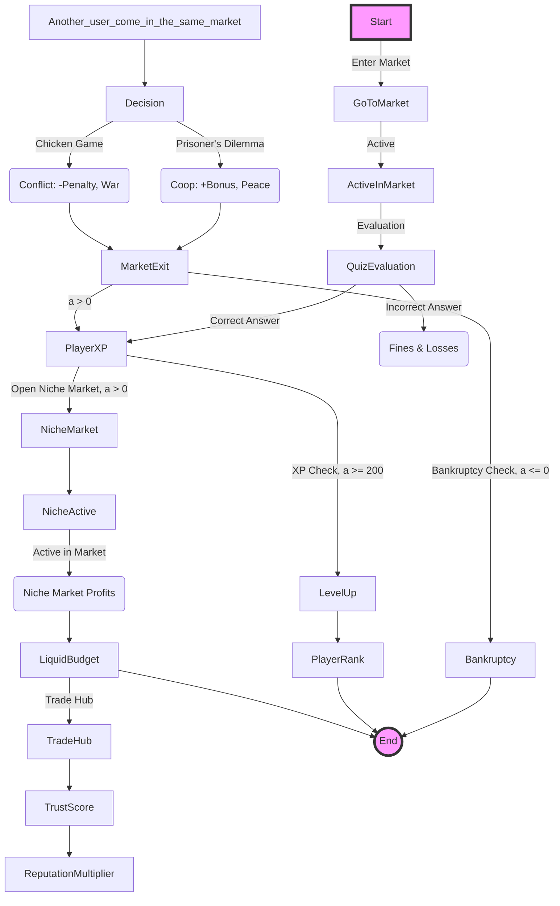

```mermaid
graph TD;
    Start --> |Enter Market| GoToMarket;
    GoToMarket --> |Active| ActiveInMarket;
    ActiveInMarket --> |Evaluation| QuizEvaluation;
    QuizEvaluation --> |Correct Answer| PlayerXP;
    QuizEvaluation --> |Incorrect Answer| Losses(Fines & Losses);

    PlayerXP --> |XP Check, a >= 200| LevelUp;
    LevelUp --> PlayerRank;

    PlayerXP --> |Open Niche Market, a > 0| NicheMarket;
    NicheMarket --> NicheActive;
    NicheActive --> |Active in Market| Profits(Niche Market Profits);
    Profits --> LiquidBudget;

    LiquidBudget --> |Trade Hub| TradeHub;
    TradeHub --> TrustScore;
    TrustScore --> ReputationMultiplier;

    Another_user_come_in_the_same_market --> Decision
    Decision --> |Prisoner's Dilemma| PD_Coop(Coop: +Bonus, Peace)
    PD_Coop --> MarketExit;
    Decision --> |Chicken Game| CG_Conflict(Conflict: -Penalty, War)
    CG_Conflict --> MarketExit;

    MarketExit --> |Bankruptcy Check, a <= 0| Bankruptcy;
    MarketExit --> |a > 0| PlayerXP;

    Bankruptcy --> Stop;
    PlayerRank --> Stop;
    LiquidBudget --> Stop;
    Stop((End))

    %% Legend
    style Start fill:#f9f,stroke:#333,stroke-width:4px
    style Stop fill:#f9f,stroke:#333,stroke-width:4px
```
